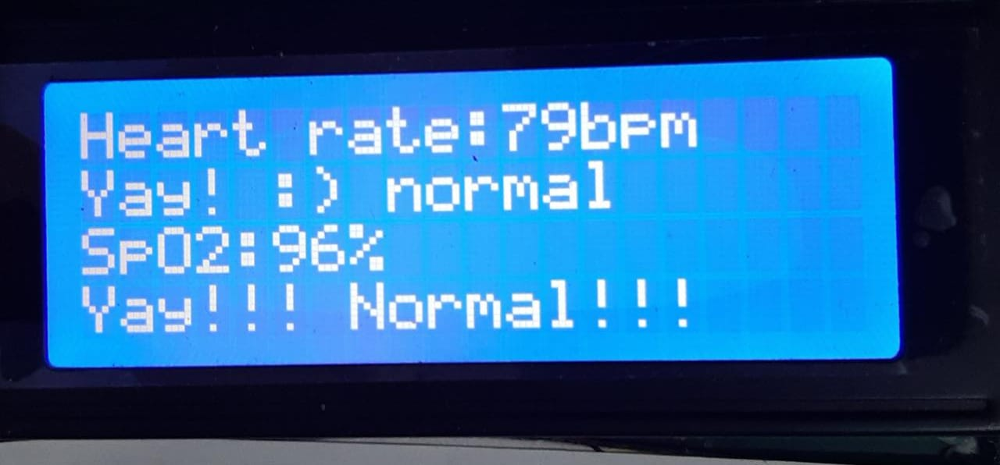

Heart rate and oxygen percentage in blood of a human are one of the fundamental bio-medical parameters analysed for study as well as medical diagnosis. Both these parameters should be within a certain prescribed range otherwise it may indicate a severe abnormality in the human body. In this work the proposed Pulse Oxi Meter measures these two parameters. In this prototype, we adopt a module, known as Pulse oxi Meter which measures number of heart beats per second i.e. heart rate and oxygen percentage in blood which is also called as SpO2 percentage in a non-invasiveway and are displayed on a LCD.

In this project a prototype for pulse-oximeter is designed. The meter is desired to indicatethe oxygen saturation in the blood and the pulse rate. The output also indicates whether the indicated results fall in the category of normal or abnormal subjects. The parameters measurement of the blood in non-invasiveway is a challenging task.  The approach adopted uses the absorptive properties of thehaemoglobin contents of the body. The output for the meter was successfully obtained onthe LCD display. Depending on the threshold chosen for heart rate as 120 bpm and forSpO2 as 90%, the normal or abnormal is also displayed.
